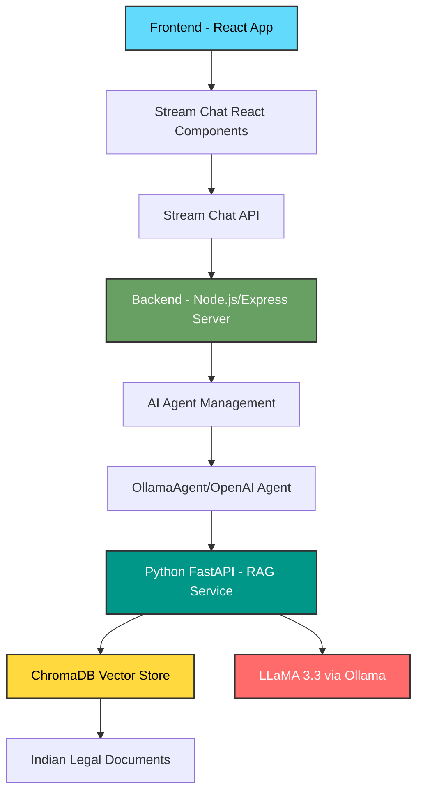

# LawStreet - AI-Powered Legal Assistant

A comprehensive AI-powered legal assistant platform for Indian law, featuring real-time chat with an intelligent AI agent, RAG-based legal document search, and a modern web interface.

## 🎯 Overview

LawStreet is a full-stack application that combines a React-based chat interface with an AI-powered backend to provide accurate answers to legal questions about Indian law. The system uses Retrieval-Augmented Generation (RAG) to query a comprehensive database of Indian legal documents including IPC, CrPC, Constitution of India, and various other Acts.

## ✨ Key Features

- **🤖 Real-time AI Chat** - Interactive chat interface with AI writing assistant
- **📚 RAG-based Legal Search** - Retrieval-augmented generation using ChromaDB and LLaMA 3.3
- **💬 Stream Chat Integration** - Real-time messaging powered by Stream Chat SDK
- **🎨 Modern UI** - Beautiful, responsive interface built with React and Tailwind CSS
- **🔄 Multi-Agent Support** - Dynamic AI agent management with automatic cleanup
- **📖 Comprehensive Legal Database** - Indian Penal Code, CrPC, Constitution, Evidence Act, and more
- **🌓 Dark/Light Mode** - Full theme support

## 🏗️ Architecture

### Integration Flow



### System Components

#### 1. Frontend (React + TypeScript + Vite)
- **Tech Stack**: React 18, TypeScript, Tailwind CSS, Radix UI
- **Chat Integration**: Stream Chat React SDK
- **Features**:
  - Real-time chat interface
  - AI agent control panel
  - Writing prompts toolbar
  - Responsive design with dark/light themes
  - Authentication system

#### 2. Backend (Node.js + Express + TypeScript)
- **Tech Stack**: Node.js, Express, TypeScript, Stream Chat SDK
- **Features**:
  - AI agent lifecycle management (start/stop/status)
  - Token generation for Stream Chat
  - Multi-platform agent support (OpenAI, Ollama)
  - Automatic agent cleanup on inactivity
  - RESTful API endpoints

#### 3. LLM Service (Python + FastAPI)
- **Tech Stack**: Python 3.8+, FastAPI, ChromaDB, Sentence Transformers, Ollama
- **Features**:
  - RAG pipeline for legal document retrieval
  - Vector embeddings using sentence-transformers
  - LLaMA 3.3 integration via Ollama
  - Persistent vector store with ChromaDB
  - Source citation in responses

## 📁 Project Structure

```
LawStreet/
├── frontend/                 # React frontend application
│   ├── src/
│   │   ├── components/      # React components
│   │   │   ├── chat-*.tsx   # Chat interface components
│   │   │   ├── ui/          # Shadcn/UI components
│   │   │   └── ...
│   │   ├── providers/       # Context providers
│   │   ├── hooks/           # Custom React hooks
│   │   └── lib/             # Utilities
│   └── package.json
│
├── backend/                  # Node.js backend server
│   ├── src/
│   │   ├── index.ts         # Main server file
│   │   ├── serverClient.ts  # Stream Chat client
│   │   └── agents/          # AI agent implementations
│   │       ├── createAgent.ts
│   │       ├── ollama/      # Ollama agent
│   │       └── openai/      # OpenAI agent
│   └── package.json
│
├── llm/                      # Python RAG service
│   ├── app/
│   │   ├── main.py          # FastAPI application
│   │   ├── rag.py           # RAG pipeline
│   │   ├── embed.py         # Embedding model
│   │   └── config.py        # Configuration
│   ├── Data/                # Legal documents (JSON)
│   │   ├── ipc.json
│   │   ├── crpc.json
│   │   ├── constitution.json
│   │   └── ...
│   ├── scripts/             # Data indexing scripts
│   │   ├── index_data.py
│   │   └── clean_data.py
│   ├── vectorstore/         # ChromaDB storage
│   └── requirements.txt
│
└── README.md
```

## 🚀 Getting Started

### Prerequisites

- **Node.js** 20+ and npm
- **Python** 3.8+
- **Ollama** installed and running ([Install Ollama](https://ollama.ai))
- **Stream Chat Account** (for API keys)

### Installation

#### 1. Install Ollama and LLaMA 3.3

```powershell
# Download and install Ollama from https://ollama.ai

# Pull LLaMA 3.3 model
ollama pull llama3.3

# Verify installation
ollama list
```

#### 2. Setup Python RAG Service

```powershell
cd llm

# Create virtual environment
python -m venv venv
.\\venv\\Scripts\\Activate.ps1

# Install dependencies
pip install -r requirements.txt

# Index legal documents to ChromaDB
python scripts/index_data.py

# Start FastAPI server
python -m uvicorn app.main:app --reload --host 0.0.0.0 --port 8000
```

The RAG service will be available at `http://localhost:8000`

#### 3. Setup Backend Server

```powershell
cd backend

# Install dependencies
npm install

# Create .env file
cp .env.example .env
# Edit .env and add your Stream Chat credentials:
# STREAM_API_KEY=your_api_key
# STREAM_API_SECRET=your_api_secret

# Start development server
npm run dev
```

The backend will be available at `http://localhost:3000`

#### 4. Setup Frontend

```powershell
cd frontend

# Install dependencies
npm install

# Create .env file
cp .env.example .env
# Edit .env and add:
# VITE_STREAM_API_KEY=your_stream_api_key
# VITE_BACKEND_URL=http://localhost:3000

# Start development server
npm run dev
```

The frontend will be available at `http://localhost:5173`

## 🔧 Configuration

### Environment Variables

#### Backend (.env)
```env
STREAM_API_KEY=your_stream_api_key
STREAM_API_SECRET=your_stream_api_secret
PORT=3000
```

#### Frontend (.env)
```env
VITE_STREAM_API_KEY=your_stream_api_key
VITE_BACKEND_URL=http://localhost:3000
```

#### LLM Service (app/config.py)
```python
OLLAMA_BASE_URL = "http://localhost:11434"
MODEL_NAME = "llama3.3"
TOP_K = 5  # Number of documents to retrieve
MAX_CONTEXT_LENGTH = 4000
```

## 📡 API Endpoints

### Backend API (Port 3000)

| Endpoint | Method | Description |
|----------|--------|-------------|
| `/` | GET | Server status and info |
| `/start-ai-agent` | POST | Start AI agent for a channel |
| `/stop-ai-agent` | POST | Stop AI agent for a channel |
| `/agent-status` | GET | Get agent status |
| `/token` | POST | Generate Stream Chat token |

### LLM Service API (Port 8000)

| Endpoint | Method | Description |
|----------|--------|-------------|
| `/` | GET | API information |
| `/ask` | POST | Query legal documents |
| `/health` | GET | System health check |

#### Example Request to /ask

```json
POST http://localhost:8000/ask
Content-Type: application/json

{
  "query": "What is Section 302 IPC?"
}
```

#### Example Response

```json
{
  "answer": "Section 302 of the Indian Penal Code deals with punishment for murder...",
  "query": "What is Section 302 IPC?",
  "num_retrieved_docs": 5,
  "sources": [
    {
      "source": "IPC",
      "section": "302",
      "distance": 0.23
    }
  ]
}
```

## 🧪 Testing

### Test RAG Service

```powershell
cd llm
python test_query.py
```

### Check Database

```powershell
cd llm
python check_db.py
```

## 🛠️ Tech Stack

### Frontend
- React 18 with TypeScript
- Vite for build tooling
- Tailwind CSS for styling
- Stream Chat React for real-time messaging
- Radix UI components
- React Router for navigation
- Framer Motion for animations

### Backend
- Node.js with Express
- TypeScript
- Stream Chat SDK
- Axios for HTTP requests

### LLM Service
- Python 3.8+
- FastAPI for REST API
- ChromaDB for vector storage
- Sentence Transformers for embeddings
- Ollama + LLaMA 3.3 for LLM inference
- Pydantic for data validation

## 📚 Legal Documents Included

- **Indian Penal Code (IPC)** - Criminal offenses and punishments
- **Code of Criminal Procedure (CrPC)** - Criminal procedure
- **Constitution of India** - Fundamental law
- **Indian Evidence Act** - Rules of evidence
- **Hindu Marriage Act (HMA)**
- **Motor Vehicles Act (MVA)**
- **Negotiable Instruments Act (NIA)**
- **Income Tax Act (IDA)**

## 🤝 Contributing

Contributions are welcome! Please feel free to submit a Pull Request.

## 📄 License

Copyright (c) 2024-2025 LawStreet

All Rights Reserved.

This software and associated documentation files (the "Software") are proprietary and confidential. Unauthorized copying, modification, distribution, or use of this Software, via any medium, is strictly prohibited without explicit written permission from the copyright holder.

For licensing inquiries, please contact: [nabaruproy.dev@gmail.com]

## 🙏 Acknowledgments

- Stream Chat for real-time messaging infrastructure
- Ollama for local LLM inference
- Meta AI for LLaMA 3.3 model
- Sentence Transformers for embedding models
- ChromaDB for vector storage

## 📞 Support

For questions or support, please open an issue in the repository or contact the maintainers.

---

**Built with ❤️ for the legal community**
