# LawStreet - User Flow Documentation

This document provides a comprehensive guide to the user experience and interaction flows within the LawStreet AI-Powered Legal Assistant platform.

---

## 📋 Table of Contents

1. [Overview](#overview)
2. [User Journey Map](#user-journey-map)
3. [Detailed User Flows](#detailed-user-flows)
4. [State Management](#state-management)
5. [Error Handling](#error-handling)
6. [UI/UX Features](#uiux-features)

---

## 🎯 Overview

LawStreet provides an intuitive, conversational interface for querying Indian legal documents. The application follows a modern chat-based UX pattern with AI agent integration.

### Key User Interactions

- **Authentication** - Simple username-based login
- **Chat Management** - Create, switch, and delete conversations
- **AI Agent Control** - Toggle AI assistance on/off
- **Legal Queries** - Ask questions and receive AI-powered answers with citations
- **Theme Customization** - Switch between dark/light modes

---

## 🗺️ User Journey Map

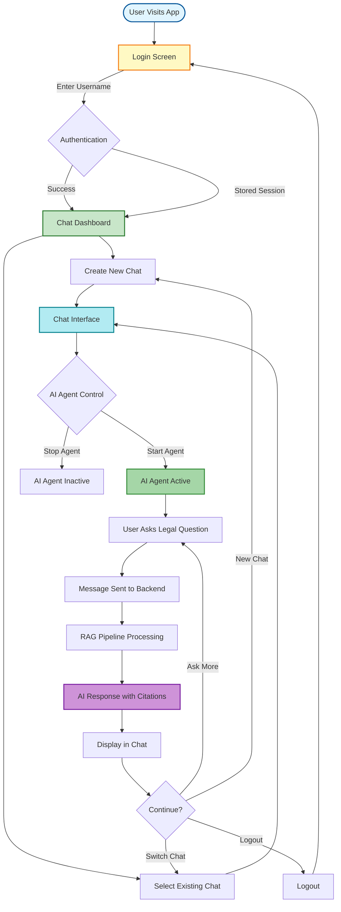

---

## 🔄 Detailed User Flows

### 1. Authentication Flow

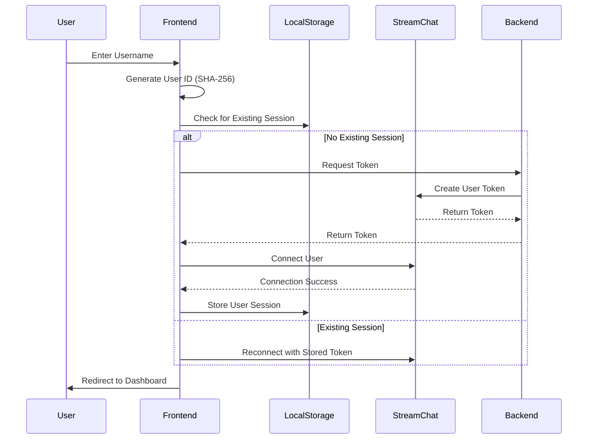

#### Key Steps:
1. **User enters username** in the login form
2. **SHA-256 hash** creates deterministic user ID from username
3. **Token generation** via backend API endpoint
4. **Stream Chat connection** established
5. **Session persistence** in localStorage
6. **Avatar generation** using DiceBear API

---

### 2. Chat Creation & Management Flow

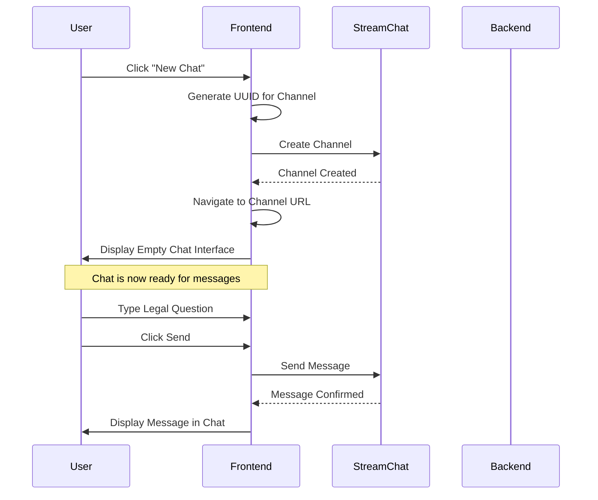

#### Chat Management Features:

**Creating a Chat:**
- Click "New Chat" button in sidebar
- Auto-generates unique channel ID using UUID v4
- Creates new Stream Chat channel
- Redirects to `/chat/:channelId` route
- Empty state shows writing prompt suggestions

**Switching Chats:**
- Click on chat in sidebar
- Loads channel history from Stream Chat
- Updates URL with new channel ID
- Preserves AI agent state per channel

**Deleting Chats:**
- Click delete icon on chat item
- Confirmation dialog appears
- Deletes channel from Stream Chat
- Removes from sidebar
- Redirects to dashboard if current chat deleted

---

### 3. AI Agent Lifecycle Flow

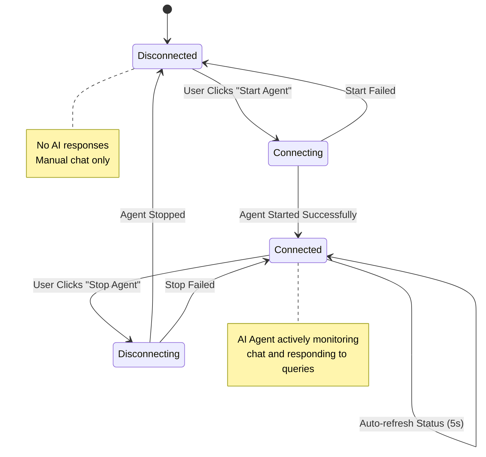

#### AI Agent States:

| State | Description | User Action | Visual Indicator |
|-------|-------------|-------------|------------------|
| **Disconnected** | Agent is offline | Can start agent | Gray badge with BotOff icon |
| **Connecting** | Agent is starting | Wait for connection | Orange badge with spinner |
| **Connected** | Agent is active | Can stop agent | Green badge with Bot icon |
| **Disconnecting** | Agent is stopping | Wait for disconnect | Orange badge with spinner |

#### Backend Agent Management:

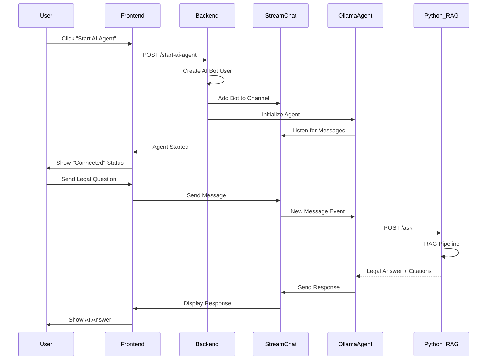

---

### 4. Legal Query Processing Flow

```mermaid
graph LR
    A[User Types Question] --> B[Send Message]
    B --> C[Stream Chat API]
    C --> D{AI Agent Active?}
    
    D -->|No| E[Message Only]
    D -->|Yes| F[OllamaAgent Receives]
    
    F --> G[Python RAG Service]
    G --> H[Embed Query]
    H --> I[Search ChromaDB]
    I --> J[Retrieve Top-K Documents]
    J --> K[Build Context]
    K --> L[LLaMA 3.3 Generation]
    L --> M[Format Response]
    M --> N[Return Answer + Sources]
    N --> O[Agent Sends to Chat]
    O --> P[Display in UI]
    
    style A fill:#e3f2fd,stroke:#1976d2
    style G fill:#fff3e0,stroke:#e65100
    style L fill:#f3e5f5,stroke:#7b1fa2
    style P fill:#e8f5e9,stroke:#388e3c
```

#### Query Processing Steps:

1. **User Input**
   - User types legal question in chat input
   - Message sent to Stream Chat API
   - Displayed immediately in chat window

2. **AI Agent Detection**
   - OllamaAgent listening to channel events
   - Filters out bot's own messages
   - Processes user messages only

3. **RAG Pipeline Execution**
   ```
   Query → Embedding → Vector Search → Context Building → LLM → Response
   ```

4. **Vector Search**
   - Query embedded using sentence-transformers
   - ChromaDB performs similarity search
   - Retrieves top 5 most relevant legal documents

5. **Context Assembly**
   - Combines retrieved documents
   - Adds legal document metadata
   - Builds structured prompt

6. **LLM Generation**
   - LLaMA 3.3 processes prompt
   - Generates answer based on retrieved context
   - Includes source citations

7. **Response Delivery**
   - Formatted response sent to Stream Chat
   - Rendered in chat interface
   - Shows source documents with section numbers

---

### 5. Writing Prompts & Quick Actions Flow

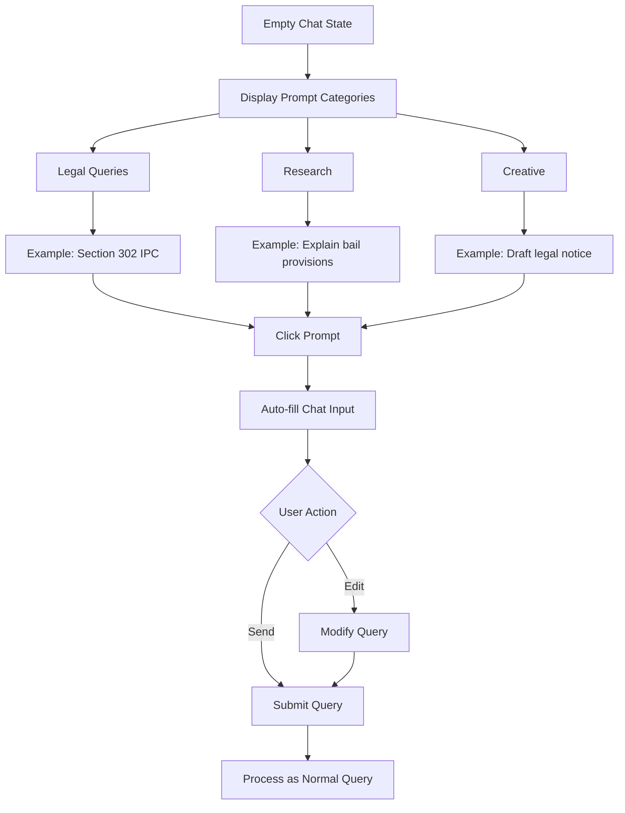

#### Available Prompt Categories:

**Legal Queries:**
- What is Section 302 IPC?
- Explain bail provisions under CrPC
- What are fundamental rights in Constitution?
- Define digital evidence under Indian Evidence Act

**Research:**
- Compare IPC and CrPC procedures
- Summarize motor vehicle accident laws
- Explain Hindu Marriage Act divorce grounds

**Creative:**
- Draft a legal notice for property dispute
- Write a bail application
- Create a contract template

---

## 🎨 UI/UX Features

### Responsive Design

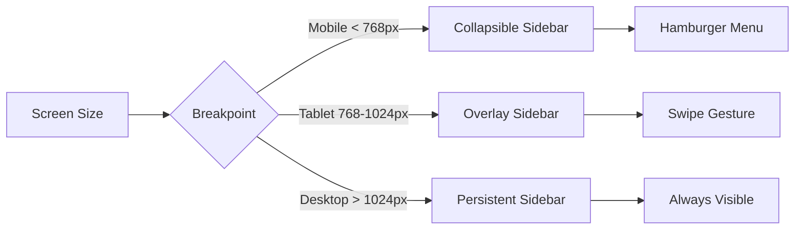

### Theme Support

- **Dark Mode** - Default, eye-friendly for long reading
- **Light Mode** - Clean, professional appearance
- **System Sync** - Matches OS preference
- **Persistent** - Saved in localStorage

### Real-time Updates

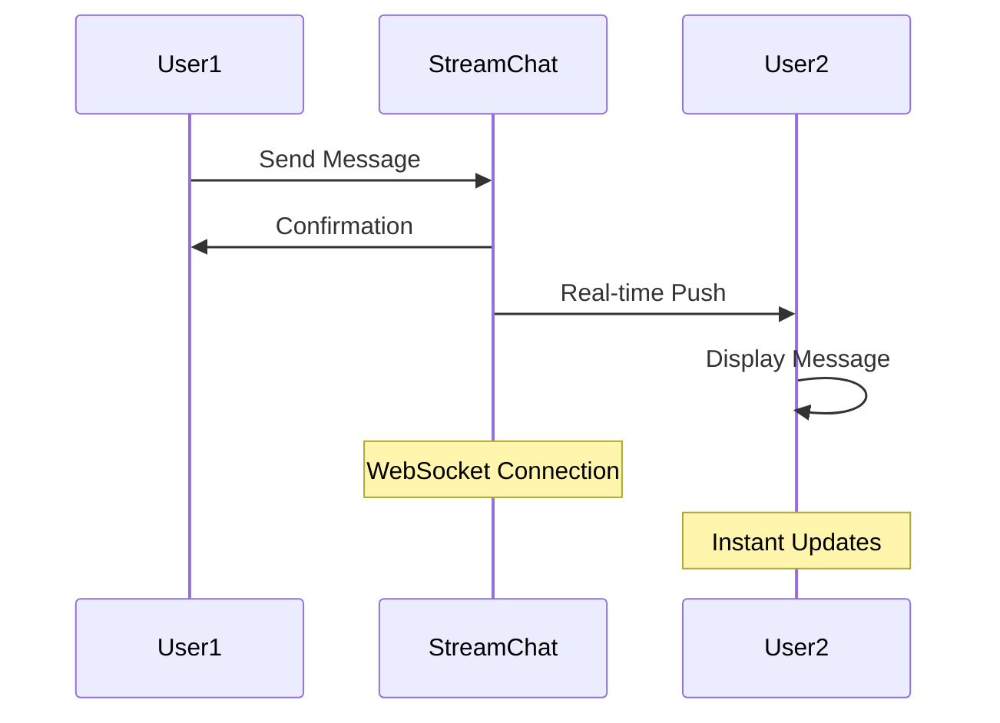

---

## 🔧 State Management

### Application State Hierarchy

```
App (Root)
├── ThemeProvider (Dark/Light)
├── AuthState (User Session)
└── ChatProvider (Stream Chat Context)
    ├── Active Channel
    ├── Channel List
    ├── AI Agent Status
    └── Message State
```

### Local Storage Schema

```typescript
{
  "llm-chat-frontend-user": {
    "id": "user_abc123...",
    "name": "John Doe",
    "image": "https://api.dicebear.com/..."
  },
  "vite-ui-theme": "dark" | "light" | "system"
}
```

### Stream Chat State

- **User Connection** - Maintained by Stream Chat SDK
- **Channels** - Lazy loaded on demand
- **Messages** - Paginated, infinite scroll
- **Presence** - Online/offline status
- **Typing Indicators** - Real-time typing status

---

## ⚠️ Error Handling

### Error Types & User Feedback

| Error Type | User Message | Recovery Action |
|------------|--------------|-----------------|
| **Network Failure** | "Connection lost. Retrying..." | Auto-retry with exponential backoff |
| **Agent Start Failed** | "Failed to start AI agent" | Manual retry button |
| **Query Timeout** | "Request timed out" | Retry query option |
| **Invalid Token** | "Session expired. Please login again" | Redirect to login |
| **Channel Not Found** | "Chat not found" | Redirect to dashboard |
| **RAG Service Down** | "AI service unavailable" | Show error state, retry |

### Error Flow Example

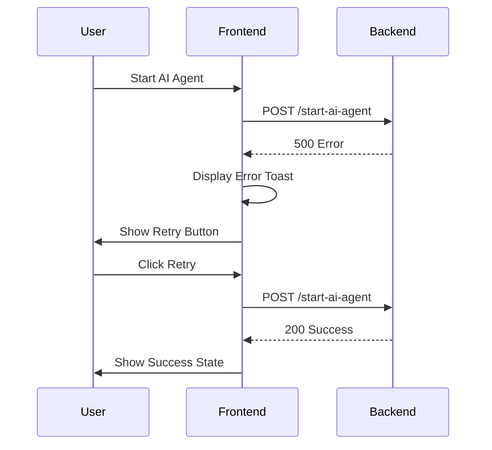

---

## 🔄 Auto-refresh & Polling

### AI Agent Status Polling

- **Interval**: Every 5 seconds when agent is active
- **Purpose**: Detect backend disconnections
- **Cleanup**: Stops when channel changes or component unmounts

### Channel List Refresh

- **Trigger**: On channel creation/deletion
- **Method**: Stream Chat real-time events
- **UI Update**: Automatic sidebar refresh

---

## 📱 Mobile Experience

### Touch Interactions

1. **Swipe to Open Sidebar** - Left swipe reveals chat list
2. **Swipe to Close** - Right swipe closes sidebar
3. **Pull to Refresh** - Reload channel list
4. **Long Press** - Show message options

### Mobile-Specific Features

- Collapsible sidebar with overlay
- Touch-optimized buttons (44px min)
- Bottom-anchored input field
- Floating action button for new chat

---

## 🎯 User Goals & Success Metrics

### Primary User Goals

1. ✅ **Quick Legal Answers** - Get accurate information in < 10 seconds
2. ✅ **Source Verification** - See exact section/article citations
3. ✅ **Multi-topic Research** - Maintain separate chats for different queries
4. ✅ **Conversation History** - Access past queries and responses

### Success Indicators

- **Time to Answer**: < 5 seconds average response time
- **Accuracy**: Sources cited for 100% of answers
- **Ease of Use**: < 3 clicks to start new query
- **Reliability**: 99%+ uptime for chat interface

---

## 📊 User Flow Analytics Points

### Tracking Opportunities

1. **Login Events** - New vs returning users
2. **Chat Creation** - Frequency and patterns
3. **AI Agent Usage** - Start/stop frequency
4. **Query Types** - Most common legal topics
5. **Session Duration** - Average time spent
6. **Error Rates** - Failed requests and types

---

## 🚀 Onboarding Flow

### First-Time User Experience

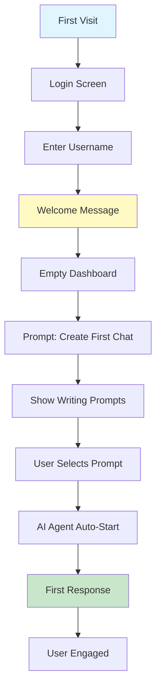

### Onboarding Tips

1. **Welcome Toast** - "Welcome! Start by creating your first chat"
2. **Prompt Suggestions** - Show 4-6 example queries
3. **AI Agent Hint** - "Toggle AI agent for automatic responses"
4. **Feature Tour** - Optional walkthrough (future enhancement)

---

## 🔐 Security Considerations

### Data Protection

- **User IDs**: SHA-256 hashed, deterministic but secure
- **Tokens**: JWT-based, short-lived (1 hour expiry)
- **LocalStorage**: User preferences only, no sensitive data
- **HTTPS**: All production traffic encrypted

### Privacy

- **No Registration Required** - Username-only authentication
- **Ephemeral Sessions** - Can logout and create new identity
- **No Data Retention** - Messages stored only in Stream Chat
- **Anonymous Usage** - No email or personal info collected

---

## 📝 Summary

The LawStreet user flow emphasizes:

- **Simplicity** - Minimal steps to get answers
- **Intelligence** - AI-powered responses with citations
- **Flexibility** - Multiple chats, agent control, theme options
- **Reliability** - Error handling, auto-retry, status monitoring
- **Accessibility** - Responsive design, keyboard navigation

The application provides a seamless experience for legal research, combining modern chat UX with powerful RAG-based AI capabilities.

---

**Last Updated**: November 18, 2025
